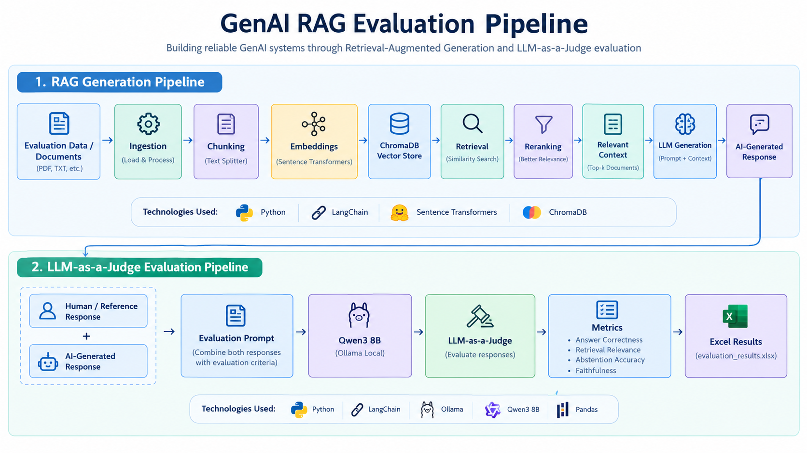
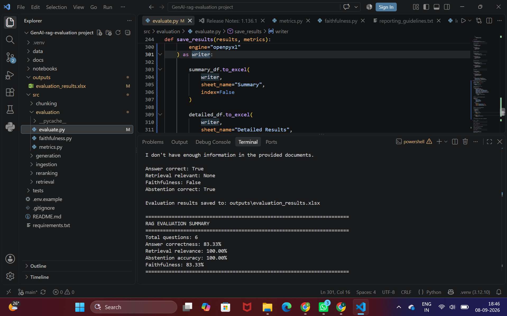

# GenAI RAG Evaluation Pipeline

## Overview

This project focuses on evaluating the quality of responses generated by a Retrieval-Augmented Generation (RAG) system.

The project goes beyond building a RAG pipeline by implementing an **LLM-as-a-Judge evaluation approach** to systematically assess AI-generated responses against human/reference responses.

## What This Project Does

The pipeline:

- Loads and processes evaluation data
- Retrieves relevant information from a vector database
- Applies reranking to improve retrieved context
- Generates responses using an LLM
- Evaluates generated responses using an LLM-as-a-Judge
- Compares AI-generated responses with human/reference responses
- Produces structured evaluation results
- Exports the evaluation results to Excel

## Evaluation Criteria

The evaluation pipeline assesses responses across the following dimensions:

- **Behavior**
- **Preference**
- **Motivation**
- **Overall Fidelity Score**

The evaluator used in this project is **Qwen3 8B**, running locally through **Ollama**.

## RAG Pipeline

~~~text
Documents
    ↓
Document Loading
    ↓
Text Chunking
    ↓
Embeddings
    ↓
Vector Database
    ↓
Retriever
    ↓
Reranker
    ↓
Relevant Context
    ↓
LLM
    ↓
Generated Response
~~~

## Evaluation Pipeline

~~~text
Human / Reference Response
              +
       AI-Generated Response
              ↓
      Evaluation Prompt
              ↓
        Qwen3 8B
       (Ollama Local)
              ↓
      LLM-as-a-Judge
              ↓
     Evaluation Scores
              ↓
       Excel Results
~~~

## Evaluation Results

The current evaluation run produced the following results:

| Metric | Score |
|---|---:|
| Answer Correctness | 66.67% |
| Retrieval Relevance | 100.00% |
| Abstention Accuracy | 100.00% |
| Evaluation Questions | 6 |

Detailed evaluation results are available in:

`outputs/evaluation_results.xlsx`

## Tech Stack

- **Python**
- **LangChain**
- **ChromaDB**
- **Sentence Transformers**
- **Ollama**
- **Qwen3 8B**
- **Pandas**
- **FastAPI**
- **Docker**

## Project Structure

~~~text
GenAI-rag-evaluation/
│
├── data/
│   └── Evaluation dataset
│
├── outputs/
│   └── evaluation_results.xlsx
│
├── src/
│   ├── ingestion/
│   ├── retrieval/
│   ├── generation/
│   └── evaluation/
│
├── .env.example
├── .gitignore
├── README.md
└── requirements.txt
~~~

## How to Run

### 1. Clone the repository

~~~bash
git clone https://github.com/SARASWATHI2000-afk/GenAI-rag-evaluation.git
cd GenAI-rag-evaluation
~~~

### 2. Create a virtual environment

~~~bash
python -m venv .venv
~~~

Activate it on Windows:

~~~bash
.venv\Scripts\activate
~~~

### 3. Install dependencies

~~~bash
pip install -r requirements.txt
~~~

### 4. Install Ollama

Install Ollama and pull the required model:

~~~bash
ollama pull qwen3:8b
~~~

### 5. Run the evaluation

Run the evaluation pipeline using the scripts provided under `src/evaluation/`.

## Key Learning

This project demonstrates that building a RAG application is only one part of developing a reliable GenAI system.

A production-oriented GenAI application also needs a systematic evaluation strategy to measure response quality, retrieval quality, and the ability of the system to abstain when appropriate.

## Future Improvements

- Add larger evaluation datasets
- Add automated evaluation dashboards
- Compare multiple LLM judges
- Add experiment tracking
- Evaluate hallucination and faithfulness
- Integrate continuous evaluation into the RAG pipeline
